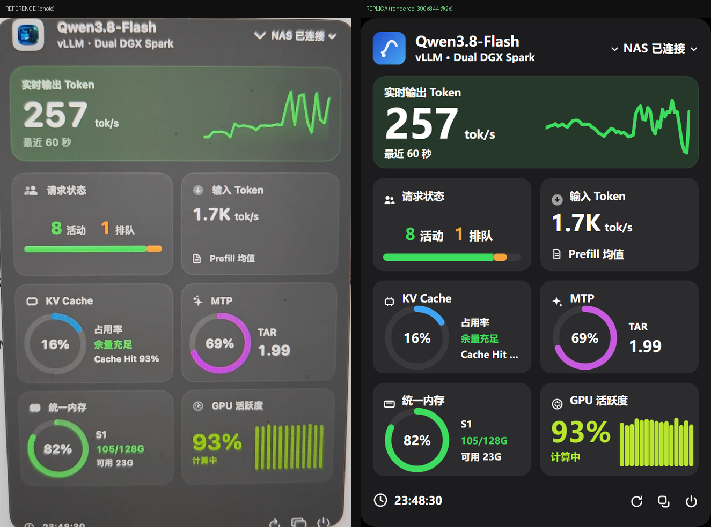
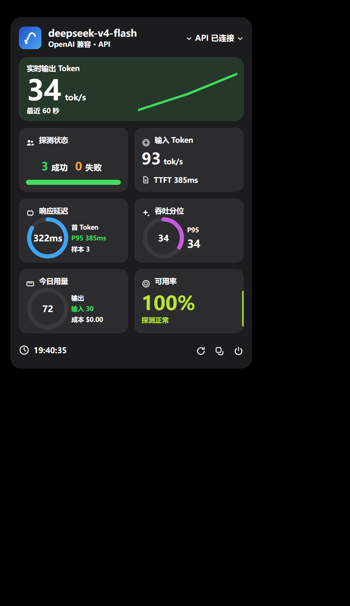
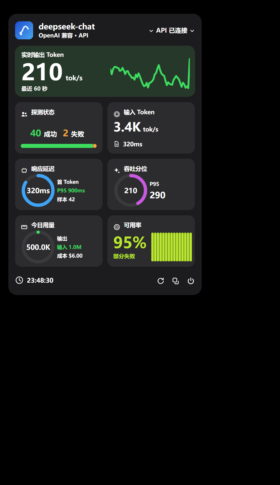

# Tokmeter（トークメーター）

[中文](README.md) | [English](README.en.md) | **日本語** | [한국어](README.ko.md)

> **LLM 推論サービスのリアルタイム状態パネル** —— 依存ゼロ・オフライン動作・単一ファイル。



*左：参考デザイン ｜ 右：Tokmeter の再現パネル（パネルの縦横比 1.4540 対 参考 1.4518、差は 0.16%）*

Tokmeter は純粋な**観測パネル**です。推論をプロキシせず、リクエストを書き換えず、モデルに一切触れません。
ただ「いま何が起きているか」を正確に描画するだけです。中核となる `llm-monitor.html` は**わずか 79.4 KB の単一ファイル**で、
スタイルもスクリプトもすべてインライン化済み。ダブルクリックすればオフラインで動作し、そのまま人に渡すこともできます。

---

## 機能

- **単一ファイル・依存ゼロ**：`llm-monitor.html` は `file://` からそのまま動作。サーバー不要、ネットワーク不要、`npm install` 不要。
- **3 つのデータソース**：内蔵シミュレーター（既定）／サーバー側 vLLM メトリクス／クライアント側コレクター（クラウド API）。
- **サーバービュー**：出力 tok/s、入力 tok/s と平均 Prefill 時間、リクエストの同時実行・待ち行列・容量、KV キャッシュ使用率とヒット率、MTP 承認率と TAR、VRAM 使用量、GPU 使用率。60 点のスループットグラフ、3 つのリングゲージ、パーセンタイルバー。
- **クライアントビュー**：TTFT P50/P95、実測 tok/s P50/P95、プローブ成功率と可用率、トークン使用量とコスト概算 —— 実際に測定できるクライアント側指標だけを表示します。
- **データを捏造しない**：取得できない値は必ず `--` と表示し、偽の `0` は絶対に出しません（専用のテストで固定）。
- **自動デグレード**：エンドポイント異常時は `stale` / `error` に遷移してデータ領域を暗くし、**グラフは最後のフレームを保持、レイアウトは崩れません**。
- **フッターの 3 ボタン**：即時更新／現在の状態をコピー／監視の一時停止・再開。
- **オプションのダイナミックアイランド**：`?island=1` でカプセル表示。
- **PWA**：http(s) であれば「ホーム画面に追加」が可能。
- **Windows デスクトップ版**：フレームなし透過フローティングウィンドウ＋トレイ操作＋内蔵コレクター（別途 node プロセス不要）＋ NSIS インストーラー。
- **サードパーティ製ランタイム依存ゼロ**：パネルは素の JavaScript、コレクターは Node 標準モジュールのみ。
- **テスト充実**：ユニットテスト 91 件＋E2E プローブ検証 98 項目、すべてグリーン。

---

## インストール

### 方法 1：インストーラーをダウンロード（Windows ユーザーに推奨）

[Releases](https://github.com/thagyamin-sudo/tokmeter/releases/latest) から **`Tokmeter-0.1.0-setup.exe`**（約 87.8 MB）をダウンロードしてダブルクリックします。

- NSIS 形式（`oneClick: false` + `perMachine: false`）のため、**インストール先を自分で選べます**。管理者権限も不要です。
- デスクトップのショートカットとスタートメニュー項目を自動作成します。
- アンインストール項目の表示名は「Tokmeter（词元表）」です。

### 方法 2：ソースから実行（インストール不要・ビルド不要）

**① 単一ファイルをダブルクリック（最も簡単）**

リポジトリ直下の `llm-monitor.html` をダブルクリックするだけです。スタイルもスクリプトも完全にインライン化されているため、
`file://` でオフライン動作します。他の人に送ったり、スマートフォンに入れたりすることもできます。

**② 開発モード（編集して再読み込みするだけ、ビルド不要）**

```bash
git clone https://github.com/thagyamin-sudo/tokmeter.git
cd tokmeter
python -m http.server 8000
# ブラウザで http://localhost:8000 を開く
```

> 静的サーバーなら何でも構いません（`npx serve`、`caddy file-server` など）。
> PWA のインストール（「ホーム画面に追加」）は http(s) でのみ利用可能です。単一ファイルを `file://` で開いた場合はインストールできません。

---

## 使い方ガイド

### 1. 3 つのデータソース

既定では、右上のステータス・グラフ・すべての数値は内蔵の**シミュレーター**から供給されます（シード可能で再現性があり、デモや比較に最適）。
実サービスに向けるには URL パラメータを付けるだけで、コード変更は不要です。

| シナリオ | URL |
| --- | --- |
| 内蔵シミュレーター（既定） | `llm-monitor.html` |
| vLLM ネイティブ metrics エンドポイント | `llm-monitor.html?source=vllm&endpoint=http://127.0.0.1:8000/metrics` |
| 独自 JSON エンドポイント | `llm-monitor.html?source=http&endpoint=http://127.0.0.1:9000/snapshot` |
| クラウド API クライアントコレクター | `llm-monitor.html?view=client` |

**vLLM モード**は以下の Prometheus メトリクスを読み取ります（欠けているものは前フレームを踏襲し、**NaN は絶対に表示しません**）：
`vllm:num_requests_running`、`vllm:num_requests_waiting`、`vllm:avg_generation_throughput_toks_per_s`、
`vllm:gpu_cache_usage_perc`、`vllm:gpu_prefix_cache_hit_rate`。モデル名はメトリクスのラベルから取得し、取得できない場合は「未知のモデル」と表示します。

**JSON モード**は内部スナップショットと同じ形のオブジェクトを受け付けます（欠けたフィールドは前フレームを踏襲）：

```json
{
  "model":    { "name": "Qwen3.8-Flash", "engine": "vLLM", "nodes": "Dual DGX Spark" },
  "output":   { "tokPerSec": 257 },
  "requests": { "active": 8, "queued": 1, "capacity": 10 },
  "input":    { "tokPerSec": 1700, "prefillAvgMs": 320 },
  "kvCache":  { "usage": 0.16, "hitRate": 0.93, "headroom": "余裕あり" },
  "mtp":      { "ratio": 0.69, "tar": 1.99 },
  "memory":   { "node": "S1", "usedGB": 105, "totalGB": 128, "freeGB": 23 },
  "gpu":      { "utilization": 0.93, "state": "計算中" }
}
```

### 2. クラウド API への接続（クライアントビュー、2 ステップ）

クラウド API は KV キャッシュ・GPU・VRAM といった**サーバー内部の量**を公開しません。そのためクライアントビューは
サーバー側指標を装わず、実際に測定できるクライアント側指標のみを表示し、それ以外はすべて `--` とします。

**ステップ 1 — 設定を記入**

```bash
cp collector.config.example.json collector.config.json
# collector.config.json を編集し、最低限 baseUrl / apiKey / model を記入
```

**ステップ 2 — コレクターを起動**

```bash
node collector.js                        # 同ディレクトリの collector.config.json を読む
node collector.js D:/path/my-config.json  # 別の設定ファイルを指定することも可能
```

その後パネルを開きます：`llm-monitor.html?view=client`（開発時は `index.html?view=client`）。

コレクターは 2 つのことを行います。

1. **アクティブプローブ**（既定）：`probeEveryMs` ごとに小さなストリーミングリクエストを 1 回送信し（既定 15 秒、`max_tokens` 24、最小間隔 5 秒）、TTFT と実測 tok/s を測定します —— **アプリケーション側の変更は一切不要**です。
2. **パッシブ集計**（`"proxy": true`）：アプリケーションの `base_url` を `http://127.0.0.1:8787/v1` に向けると、実際のトラフィック・トークン使用量・コストを集計します。



*実際のゲートウェイに接続したクライアントビュー：TTFT、実測 tok/s、成功率、使用量、コストはすべてコレクターの実測値です*



**カードの対応関係**（既定のサーバービューはピクセル単位で不変。`?view=client` のときだけ切り替わります）：

| パネルのカード | クライアントビューの表示 |
| --- | --- |
| リアルタイム出力トークン | 実測出力 tok/s（ストリーミング計測） |
| プローブ状態 | ウィンドウ内の成功／失敗数＋成功率バー |
| 入力トークン | Prefill 速度（`prompt_tokens ÷ TTFT`） |
| 応答レイテンシ | 初回トークン P50（リングが多いほど速い）、サイドバーに P95 とサンプル数 |
| スループット分位 | P50 tok/s、サイドバーに P95 |
| 本日の使用量 | 出力／入力トークン累計＋コスト概算 |
| 可用率 | ウィンドウ内の成功率＋バー（各プローブの速度） |

> ⚠️ **境界**：クライアントビューが見えるのは「**コレクターを通過した**」リクエストだけです。アクティブプローブは
> あなたのアカウントが現在どれだけ速く応答するかを示します。自社アプリの実際のトラフィックとコストを集計するには、
> そのアプリの `base_url` をコレクターに向ける必要があります（パッシブモード）。

### 3. デスクトップ版：トレイとフローティングウィンドウ

インストール後に Tokmeter を起動すると、**フレームなし・透過・角丸のフローティングウィンドウ**（既定 380×620、既定で最前面）と**トレイアイコン**が表示されます。

**フローティングウィンドウ**：

- 空白部分をドラッグすれば移動できます。位置・サイズ・最前面状態・現在のビューはすべて記憶されます（`%APPDATA%\Tokmeter\state.json`）。
- ウィンドウを閉じても**トレイに格納されるだけ**で、終了はしません。

**トレイメニュー**：

| メニュー項目 | 説明 |
| --- | --- |
| コレクター状態（グレー表示） | `127.0.0.1:<port> · live/stale/error`、5 秒ごとに更新 |
| フローティングウィンドウの表示／非表示 | トレイアイコンの左クリックと同じ。ラベルはウィンドウの可視状態に追従 |
| 常に最前面（チェック可能） | `state.json` に書き込み、即時反映 |
| ビュー切替 → サーバー／クライアント | サーバー＝パネル内蔵シミュレーター、クライアント＝ローカルコレクターに接続 |
| スタートアップ時に起動（チェック可能） | `app.setLoginItemSettings`、HKCU の Run キーに書き込み |
| 設定ファイルを開く | `%APPDATA%\Tokmeter\collector.config.json` を開く |
| Tokmeter を終了 | 本当に終了（ウィンドウを閉じてもトレイに残るだけ） |

デスクトップ版は**コレクターを内蔵**しているため（メインプロセスが直接 import し `127.0.0.1` で待ち受け）、
別途 `node collector.js` を起動する必要はありません。初回起動時にテンプレートから
`%APPDATA%\Tokmeter\collector.config.json` を生成します。キーを記入し、トレイメニューの「ビュー切替 → クライアント」を選ぶだけです。

### 4. URL パラメータ一覧

| パラメータ | 値 | 既定 | 説明 |
| --- | --- | --- | --- |
| `island` | `1` | オフ | ダイナミックアイランド（カプセル）表示 |
| `view` | `server` / `client` | `server` | サーバービュー（参考デザインに一致）／クライアントビュー（クラウド API 観測） |
| `source` | `mock` / `http` / `vllm` | `mock` | データソース種別。`http` と `vllm` は `endpoint` が必須 |
| `endpoint` | URL | クライアントビューは `http://127.0.0.1:8787/snapshot` | データソースのアドレス（JSON エンドポイント／Prometheus metrics／コレクターのスナップショット） |
| `seed` | 整数 | `7` | シミュレーターの乱数シード。同じシードなら完全に再現可能 |
| `test` | `1` | オフ | 決定論的テストモード。フレームを同期的に供給し、タイマーに依存しない |
| `tick` | 整数 | `0` | テストモードで進めるフレーム数 |
| `raf` | `1` | オフ | テストモードで実際の `requestAnimationFrame` 経路を使う |
| `freeze` | `HH:MM:SS` | オフ | 時計を固定し、出力を再現可能にする |
| `press` | `power,copy,refresh` | 空 | テストモードでフッターボタンを自動クリック（カンマ区切り） |
| `inject` | `rate:<数値>` | 空 | 極端なレートを注入し、桁が増えてもヒーローカードが崩れないことを検証 |
| `name` | 任意の文字列 | 空 | モデル名を上書きし、長い名前が省略されてヘッダーを壊さないことを検証 |
| `fail` | `stale` / `error` / `both` / `1` | 空 | 強制的にデグレード状態にし、レイアウトが崩れないことを検証 |

複数のパラメータは `&` で連結します。例：
`llm-monitor.html?source=vllm&endpoint=http://127.0.0.1:8000/metrics&island=1`

### 5. フッターの 3 ボタン

パネル下部に 3 つのアイコンボタンがあります（左から順に）：

| ボタン | タイトル | 動作 |
| --- | --- | --- |
| ⟳ 更新 | 即時更新 | 現在のデータソースから直ちに 1 回取得します（HTTP／vLLM／コレクター）。シミュレーターでは視覚的なフィードバックのみ。押すと 900 ms ハイライトされます |
| ⧉ コピー | 現在の状態をコピー | 現在のスナップショットをプレーンテキストに整形してクリップボードへコピーします（先頭は `Tokmeter`。モデル名・レート・リクエスト・KV/GPU を含み、クライアントビューでは TTFT・プローブ回数・使用量・コストも含みます。不明値は `--`）。`file://` や権限不足時は `execCommand('copy')` に自動フォールバックします |
| ⏻ 電源 | 監視の一時停止／再開 | 一時停止中はデータソースを完全に停止し（以降リクエストを送信しません）、ボタンがオフ状態になります。もう一度押すとポーリングを再開します |

---

## 設定フィールド一覧

`collector.config.json`（**gitignore 済み。キーはあなたのマシン上にのみ存在します**）：

| フィールド | 型 | 既定値 | 説明 |
| --- | --- | --- | --- |
| `baseUrl` | string | `https://api.openai.com/v1` | OpenAI 互換エンドポイント。`http://` または `https://` で始まる必要があります。末尾の余分な `/` は自動的に除去されます |
| `apiKey` | string | `''` | API キー。**このローカルファイルからのみ読み込み**、パネルページにも `/snapshot` の応答にも決して現れません |
| `model` | string | `gpt-4o-mini` | モデル名。**空にはできません** |
| `port` | number | `8787` | コレクターの待ち受けポート（`1`〜`65535`）。`127.0.0.1` のみで待ち受け、LAN には公開しません |
| `probeEveryMs` | number | `15000` | アクティブプローブの間隔（ミリ秒）。**5000 以上が必須** —— プローブ費用を抑えるための下限です |
| `probeMaxTokens` | number | `24` | 各プローブの `max_tokens`。`1`〜`512` |
| `probePrompt` | string | `用一句话说明什么是缓存。` | プローブに使うプロンプト。短くしてトークンを節約するのがおすすめです |
| `proxy` | boolean | `false` | OpenAI 互換プロキシを有効化。オンの場合はアプリの `base_url` を `http://127.0.0.1:8787/v1` に向けると**実際のトラフィックをパッシブ集計**できます |
| `pricing.inPerM` | number | `0` | 入力トークン単価（**米ドル／100 万トークン**）。コスト概算に使用 |
| `pricing.outPerM` | number | `0` | 出力トークン単価（**米ドル／100 万トークン**） |
| `timeoutMs` | number | `30000` | 上流リクエストのタイムアウト（ミリ秒）。`1000` 以上 |

設定に誤りがあると、コレクターは起動時にスタックトレースではなく読めるエラーを出力します（例：`baseUrl 必须以 http:// 或 https:// 开头`）。

**コレクターが公開するエンドポイントは 3 つだけです**：

| エンドポイント | 説明 |
| --- | --- |
| `GET /snapshot` | パネルが必要とするクライアントビューのデータ（**apiKey を含みません**） |
| `GET /health` | 死活監視：`{"ok": true, "status": "live"}` |
| `POST /v1/*` | オプション（`proxy: true` のときのみ）：OpenAI 互換転送。キーはサーバー側で付与され、クライアントには渡りません |

---

## よくある質問

### Q1：ブラウザから vLLM に直結すると CORS エラーになります。

同一生成元ポリシーによってブロックされています。解決策は 2 つです。

1. **vLLM 側で許可する**：起動引数に `--allowed-origins '*'` を追加します（本番では `*` ではなく具体的なオリジンを列挙してください）。
2. **リバースプロキシ**：nginx / caddy で `/metrics` をページと同一生成元にプロキシし、`?source=vllm&endpoint=/metrics` を使います。

本プロジェクトは依存ゼロを保つため、**プロキシサービスを同梱していません**。
（コレクター自身の `/snapshot` は `Access-Control-Allow-Origin: *` を返すため、パネルがコレクターに接続する際に CORS 問題は起きません。）

### Q2：パネルが「未接続」のまま／接続できません。

順に確認してください。

1. **URL は正しいか**：`endpoint` はスキーム付きの完全なアドレスである必要があります（例：`http://127.0.0.1:8000/metrics`）。`127.0.0.1:8000` ではいけません。
2. **エンドポイントは生きているか**：ブラウザで直接開き、JSON / Prometheus テキストが返ることを確認します。vLLM の metrics ポートは推論ポートと異なることがよくあります。
3. **コレクターは起動しているか**：クライアントビューの既定は `http://127.0.0.1:8787/snapshot` です。直接開いて JSON が見えるはずです。見えなければ `node collector.js` のエラーを確認してください。
4. **`/health` を見る**：返る `status` は `connecting` / `live` / `stale` / `error` のいずれかで、「コレクターが起動していない」のか「上流に到達できない」のかを切り分けられます。
5. **上流エラー**：`/snapshot` の `client.lastError` が `上游 HTTP 401` なら、キーか baseUrl が誤っています。

パネルは異常時でも白画面になりません。ステータスが赤くなりデータ領域が暗くなりますが、**グラフは最後のフレームを保持し、パネルのサイズは変わりません**。

### Q3：`--` と表示されるのはどういう意味ですか？

`--` は**現在のデータソースではこの値を取得できない**という意味です。0 でもエラーでもありません。これは意図的な設計です。

- クラウド API は KV キャッシュ／VRAM／GPU／MTP を公開しないため、クライアントビューではこれらのカードは常に `--` です。
- vLLM のバージョンによってメトリクスが存在しない場合、そのフィールドは `--` となり、偽の `0` にはなりません。
- プローブが一度も成功していない場合、P50 / P95 も `--` です。

この挙動は専用のテストで固定されています：**「欠損したメトリクスは未知（NaN → UI では `--`）でなければならず、偽の 0 であってはならない」**。

### Q4：コスト単価（`pricing`）はどう記入しますか？

`inPerM` / `outPerM` の単位は**米ドル／100 万トークン**です。プロバイダの料金表からそのまま転記してください。

```json
"pricing": { "inPerM": 0.27, "outPerM": 1.1 }
```

- 例：入力 100 万トークンあたり $0.27、出力 100 万トークンあたり $1.10 なら上記のとおりに記入します。
- **不明な場合は 0 を入れてください**。コストは `$0.00` と表示されますが、トークン使用量は正確なままです（使用量とコストは別々に計算されます）。
- 料金表が「1000 トークンあたり」の場合は、1000 を掛けてから記入してください。
- 通貨は米ドルです。別通貨で表示したい場合はご自身で換算して記入してください（パネルは為替換算を行いません）。
- コストは**コレクターを通過した**トラフィックのみを対象とし、アクティブプローブのわずかな消費も含まれます。

### Q5：アクティブプローブはお金がかかりませんか？

既定では 15 秒ごと・`max_tokens: 24` なので、1 時間あたり約 240 回の短いリクエストになります。一般的な料金では **1 日数セント程度**です。
3 つの安全装置があります：`probeEveryMs` の下限 5000 ミリ秒、`probeMaxTokens` の上限 512、そして**直列実行**（前回が戻っていなければ次をスキップするため、滞留しません）。

### Q6：デスクトップ版のウィンドウ下部に透過の余白があるのはなぜ？

既知のトレードオフです。既定のウィンドウは 380×620 ですが、幅 380 でのパネルの自然な高さは約 510（等比スケーリング）です。
その余白もウィンドウの一部であり、マウスイベントを受け取ります。ウィンドウの高さを 510 程度にすると内容にぴったり合います。

---

## セキュリティ

- **キーはローカルにのみ保存**：`apiKey` は `collector.config.json` からのみ読み込まれ、このファイルはリポジトリ直下の `.gitignore` に記載されているため**コミットされません**。
- **秘密情報をコミットしない**：リポジトリに入っているのはプレースホルダ版の `collector.config.example.json` だけです。コミット前に `collector.config.json` がステージされていないことを確認してください。
- **パネルページにキーは含まれない**：`llm-monitor.html` は純粋な静的ファイルで、秘密情報は一切含まれません。`?view=client` のときブラウザはローカルコレクターにデータを求めるだけです。
- **`/snapshot` はキーを返さない**：コレクターは `127.0.0.1` のみで待ち受け、応答本文に `apiKey` を含みません（テストでカバー）。
- **転送時はキーをサーバー側で付与**：`proxy: true` のとき、クライアントが送ったヘッダーは破棄され、キーはコレクタープロセスが付与するためフロントエンドには渡りません。
- **最小の露出面**：コレクターが公開するのは `GET /snapshot`、`GET /health`、そして（任意の）`POST /v1/*` のみです。
- **読み取り専用の CORS**：`/snapshot` は `Access-Control-Allow-Origin: *` を返しますが、読み取り専用・ローカルホスト限定・秘密情報なしのエンドポイントです。
- **コミット前の自己チェック**：`git status --short` に `collector.config.json` が現れてはいけません。

---

## 開発と検証

```bash
node --test                                     # ユニットテスト（純粋なロジック＋ビルド＋敵対的エッジケース＋実 HTTP E2E＋コレクター）
node tools/probe.js                             # E2E プローブ：サーバービュー＋クライアントビュー＋狭い画面を実ヘッドレスブラウザで
node tools/probe.js --target=llm-monitor.html   # 同じ検証をオフライン単一ファイル成果物に対して実行
node build.js                                   # src/ と styles.css から llm-monitor.html を再生成
node tools/shot.js --out=ref/mine.png           # スクリーンショット（ref/ との並列比較用）
```

プローブとスクリーンショットのスクリプトは静的サーバーとヘッドレス Edge を自前で用意します（Edge のインストールが必要。パスは `EDGE_PATH` 環境変数で上書き可能）。

### 検証済みの数値（ローカル実測、Node v24.18.0 / Windows）

| 検証項目 | コマンド | 結果 |
| --- | --- | --- |
| ユニットテスト | `node --test` | **91 / 91 合格**、失敗 0、約 2.8 秒 |
| E2E プローブ | `node tools/probe.js` | **98 / 98 の検証項目に合格**（ビューポート 390×844、パネル 358.8×521.89） |
| 単一ファイルプローブ | `node tools/probe.js --target=llm-monitor.html` | **92 / 92 の検証項目に合格**（ビューポート 504×805、パネル 420×610.56） |
| 単一ファイルビルド | `node build.js` | `llm-monitor.html` 81,299 バイト（79.4 KB）、インライン化モジュール 11 個。再ビルドは **SHA256 がバイト単位で一致** |
| インストーラー | `Tokmeter-0.1.0-setup.exe` | 92,069,277 バイト（87.8 MB）、SHA256 `9CDD7BAF…C5165F90` |

単一ファイル成果物の SHA256：`70A5DCAF1AA9FD75CC2180C2F5A3568C34C662EE9C9DD447C449EB2674F670A3`

### 参考デザインとの一致

| 検証項目 | 結果 |
| --- | --- |
| 参考画像との並列比較で 9 領域が一致 | ✅ パネル縦横比 1.4540 対 参考 1.4518（差 0.16%） |
| 極端に狭いビューポート（320px）でも溢れず比率も不変 | ✅ プローブの狭画面実行で検証 |
| 桁の急変（2.3M）でヒーローカードが崩れない | ✅ プローブがフレームを注入し「数値＋単位がグラフ領域に侵入しない」ことを検証 |
| 毎秒更新：数値／グラフ／プログレスバー／3 つのリング／バー | ✅ 本番は 1 秒サンプリング＋rAF で合流。合流のセマンティクスはユニットテスト済み |
| 単一ファイルをダブルクリックしてオフライン動作 | ✅ プローブは `file://` で全通過（狭画面の 6 項目は iframe ホストが必要なため明示的にスキップ） |
| エンドポイント異常時に「未接続」を表示しレイアウトが崩れない | ✅ パネルのサイズが不変でグラフが最後のフレームを保持することを検証 |

---

## ディレクトリ構成

```
llm-monitor.html              ← ビルド成果物：依存ゼロの単一ファイルパネル（ダブルクリックで起動）
index.html                    開発用エントリ（ESM モジュール）
styles.css                    デザイントークンとレイアウト（寸法はすべて calc(var(--u) * N)、--u = パネル幅の 1%）
src/app.js                    組み立て層：URL パラメータ → データソース → サンプリング → rAF 合流レンダリング
src/format.js                 数値整形（範囲外・欠損は必ず -- プレースホルダ）
src/charts.js                 SVG ジオメトリ：折れ線パス／リング dasharray／バー矩形
src/units.js                  等比スケーリング単位
src/store.js                  Snapshot 契約、リングバッファ、状態コンテナ
src/scheduler.js              レンダリング間引き（1 アニメーションフレームにつき最大 1 回再描画）
src/render.js                 静的構造＋フレームごとの更新＋プローブ収集
src/sources/mock.js           模擬 vLLM テレメトリエンジン（シード可能・決定論的）
src/sources/http.js           JSON ポーリング＋デグレード／バックオフ＋transform 注入
src/sources/vllm-metrics.js   Prometheus テキストの解析とマッピング
src/sources/client.js         クライアントビューのペイロードマッピング
collector.js                  コレクターのエントリ（node collector.js）
collector/config.js           設定の既定値＋検証
collector/server.js           HTTP サービス：/snapshot、/health、任意の /v1 転送
collector/openai-probe.js     OpenAI ストリーミング応答の計測（TTFT / tok/s）
collector/stats.js            スライディングウィンドウ統計（P50/P95、成功率、使用量、コスト）
collector.config.example.json 設定テンプレート（プレースホルダのキー）
build.js                      依存なしの単一ファイルビルド
tools/probe.js                E2E プローブ
tools/shot.js                 スクリーンショット
desktop/                      Windows デスクトップ版（Electron シェル＋内蔵コレクター＋NSIS インストーラー）
tests/                        ユニットテスト（91 件）
ref/                          参考スクリーンショットと比較用成果物
```

---

## 既知の制限

- **実運用の vLLM インスタンスには未接続**：vLLM モードはローカルで偽装した `/metrics` に対して実 HTTP の E2E 検証済みですが、バージョン間で変わるフィールド名への互換性は実インスタンスでの実測が必要です。
- **バックオフの厳密なタイミング検証はなし**：Windows のタイマー粒度は約 15 ms で、厳密な計測は必ず flaky になるため、ミリ秒ではなく挙動のみを検証しています。
- **リクエストにタイムアウト／AbortController がない**：`fetch` が永遠に settle しない場合、そのポーリングは占有され続けます（リクエストは直列なので滞留はしません）。コレクター側には `timeoutMs` があります。
- **配色は写真からの逆算による推定値**：参考画像には遠近歪みと反射があります。より正確にする場合は実機で `styles.css` のトークンを目視調整してください。
- **デスクトップ版**：透過フレームなしウィンドウは一部の Windows バージョンで端をドラッグしてもサイズ変更できません（Electron の既知の制限）。トレイアイコンは Windows 11 では既定で「隠れているアイコン」に格納されるため、手動でタスクバーに固定する必要があります。

---

## ライセンス

[MIT](LICENSE) © 2026 thagyamin-sudo
