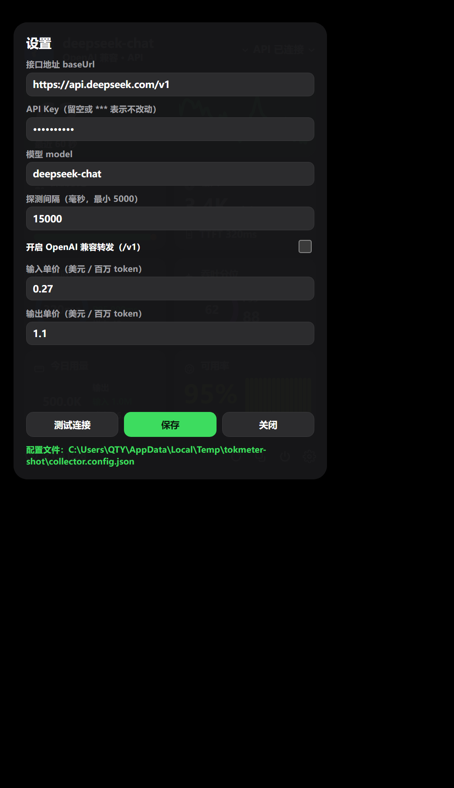

# Tokmeter (토크미터)

[中文](README.md) | [English](README.en.md) | [日本語](README.ja.md) | **한국어**

> **LLM 추론 서비스 실시간 상태 패널** —— 의존성 제로, 오프라인 동작, 단일 파일.


*왼쪽: 참고 디자인 ｜ 오른쪽: Tokmeter 재현 패널 (패널 종횡비 1.4540 대 참고 1.4518, 차이 0.16%)*

Tokmeter는 순수한 **관측 패널**입니다. 추론을 프록시하지 않고, 요청을 변조하지 않으며, 모델에 손대지 않습니다.
그저 "지금 어떤 상태인지"를 있는 그대로 그려냅니다. 핵심 산출물인 `llm-monitor.html`은 **79.4 KB 단일 파일**로,
스타일과 스크립트가 모두 인라인되어 있습니다. 더블클릭하면 오프라인으로 실행되고, 그대로 다른 사람에게 건네줄 수도 있습니다.

---

## 기능

- **단일 파일 · 의존성 제로**: `llm-monitor.html`은 `file://`에서 바로 실행됩니다. 서버도, 네트워크도, `npm install`도 필요 없습니다.
- **세 가지 데이터 소스**: 내장 시뮬레이터(기본) / 서버 측 vLLM 메트릭 / 클라이언트 측 수집기(클라우드 API).
- **서버 뷰**: 출력 tok/s, 입력 tok/s와 평균 Prefill 시간, 요청 동시 실행·대기열·용량, KV 캐시 사용률과 적중률, MTP 수락률과 TAR, VRAM 사용량, GPU 사용률. 60포인트 처리량 그래프, 링 게이지 3개, 백분위 막대.
- **클라이언트 뷰**: TTFT P50/P95, 실측 tok/s P50/P95, 프로브 성공률과 가용률, 토큰 사용량과 비용 추정 —— 실제로 측정 가능한 클라이언트 측 지표만 보여줍니다.
- **데이터를 지어내지 않음**: 얻을 수 없는 값은 반드시 `--`로 표시하며, 가짜 `0`은 절대 쓰지 않습니다(전용 테스트로 고정).
- **자동 성능 저하 처리**: 엔드포인트 이상 시 `stale` / `error`로 전환하고 데이터 영역을 어둡게 하며, **그래프는 마지막 프레임을 유지하고 레이아웃은 무너지지 않습니다**.
- **하단 버튼 3개**: 즉시 새로고침 / 현재 상태 복사 / 모니터링 일시정지·재개.
- **선택적 다이내믹 아일랜드**: `?island=1`로 캡슐 형태 표시.
- **PWA**: http(s)에서 "홈 화면에 추가" 가능.
- **Windows 데스크톱 빌드**: 프레임 없는 투명 플로팅 창 + 트레이 제어 + 내장 수집기(별도 node 프로세스 불필요) + NSIS 설치 프로그램.
- **서드파티 런타임 의존성 제로**: 패널은 순수 JavaScript, 수집기는 Node 내장 모듈만 사용.
- **테스트 충실**: 단위 테스트 91개 + E2E 프로브 검증 98항목, 전부 통과.

---

## 설치

### 방법 1 — 설치 프로그램 다운로드 (Windows 사용자 권장)

[Releases](https://github.com/thagyamin-sudo/tokmeter/releases/latest)에서 **`Tokmeter-0.2.0-setup.exe`**(약 87.8 MB)를 받아 더블클릭하세요.

- NSIS 형식(`oneClick: false` + `perMachine: false`)이라 **설치 경로를 직접 고를 수 있고**, 관리자 권한도 필요 없습니다.
- 바탕 화면 바로 가기와 시작 메뉴 항목을 자동으로 만듭니다.
- 제거 항목의 표시 이름은 "Tokmeter（词元表）"입니다.

### 방법 2 — 소스에서 실행 (설치도 빌드도 불필요)

**① 단일 파일 더블클릭 (가장 간단)**

저장소 루트의 `llm-monitor.html`을 그냥 더블클릭하세요. 스타일과 스크립트가 모두 인라인되어 있어
`file://`에서 오프라인으로 동작합니다. 다른 사람에게 보내거나 휴대폰에 넣어도 됩니다.

**② 개발 모드 (수정 후 새로고침만, 빌드 불필요)**

```bash
git clone https://github.com/thagyamin-sudo/tokmeter.git
cd tokmeter
python -m http.server 8000
# 브라우저에서 http://localhost:8000 열기
```

> 정적 서버라면 무엇이든 됩니다(`npx serve`, `caddy file-server` 등).
> PWA 설치("홈 화면에 추가")는 http(s)에서만 가능합니다. 단일 파일을 `file://`로 열면 설치할 수 없습니다.

---

## 사용 가이드

### 1. 세 가지 데이터 소스

기본적으로 오른쪽 위 상태, 그래프, 모든 숫자는 내장 **시뮬레이터**에서 나옵니다(시드 지정 가능, 재현 가능, 데모와 비교에 적합).
실제 서비스로 향하게 하려면 URL 파라미터만 붙이면 되고 코드 수정은 필요 없습니다.

| 시나리오 | URL |
| --- | --- |
| 내장 시뮬레이터(기본) | `llm-monitor.html` |
| vLLM 네이티브 metrics 엔드포인트 | `llm-monitor.html?source=vllm&endpoint=http://127.0.0.1:8000/metrics` |
| 사용자 정의 JSON 엔드포인트 | `llm-monitor.html?source=http&endpoint=http://127.0.0.1:9000/snapshot` |
| 클라우드 API 클라이언트 수집기 | `llm-monitor.html?view=client` |

**vLLM 모드**는 다음 Prometheus 메트릭을 읽습니다(없는 값은 이전 프레임을 그대로 사용하며 **NaN을 표시하지 않습니다**):
`vllm:num_requests_running`, `vllm:num_requests_waiting`, `vllm:avg_generation_throughput_toks_per_s`,
`vllm:gpu_cache_usage_perc`, `vllm:gpu_prefix_cache_hit_rate`. 모델 이름은 메트릭 레이블에서 가져오며, 얻지 못하면 "알 수 없는 모델"로 표시합니다.

**JSON 모드**는 내부 스냅샷과 같은 형태의 객체를 받습니다(없는 필드는 이전 프레임을 그대로 사용):

```json
{
  "model":    { "name": "Qwen3.8-Flash", "engine": "vLLM", "nodes": "Dual DGX Spark" },
  "output":   { "tokPerSec": 257 },
  "requests": { "active": 8, "queued": 1, "capacity": 10 },
  "input":    { "tokPerSec": 1700, "prefillAvgMs": 320 },
  "kvCache":  { "usage": 0.16, "hitRate": 0.93, "headroom": "여유 충분" },
  "mtp":      { "ratio": 0.69, "tar": 1.99 },
  "memory":   { "node": "S1", "usedGB": 105, "totalGB": 128, "freeGB": 23 },
  "gpu":      { "utilization": 0.93, "state": "계산 중" }
}
```

### 2. 클라우드 API 연결 (클라이언트 뷰, 2단계)

클라우드 API는 KV 캐시·GPU·VRAM 같은 **서버 내부 값**을 노출하지 않습니다. 그래서 클라이언트 뷰는
서버 측 지표를 흉내 내지 않고, 실제로 측정 가능한 클라이언트 측 지표만 보여주며 나머지는 모두 `--`로 표시합니다.

**1단계 — 설정 작성**

```bash
cp collector.config.example.json collector.config.json
# collector.config.json을 편집해 최소한 baseUrl / apiKey / model을 채웁니다
```

**2단계 — 수집기 실행**

```bash
node collector.js                        # 같은 폴더의 collector.config.json을 읽음
node collector.js D:/path/my-config.json  # 다른 설정 파일을 지정할 수도 있음
```

그다음 패널을 엽니다: `llm-monitor.html?view=client` (개발 시에는 `index.html?view=client`).

수집기는 두 가지 일을 합니다:

1. **능동 프로브**(기본): `probeEveryMs`마다 작은 스트리밍 요청을 한 번 보내고(기본 15초, `max_tokens` 24, 최소 간격 5초) TTFT와 실제 tok/s를 측정합니다 —— **애플리케이션은 전혀 건드리지 않습니다**.
2. **수동 집계**(`"proxy": true`): 애플리케이션의 `base_url`을 `http://127.0.0.1:8787/v1`로 향하게 하면 실제 트래픽, 토큰 사용량, 비용을 집계합니다.


*실제 게이트웨이에 연결한 클라이언트 뷰: TTFT, 실측 tok/s, 성공률, 사용량, 비용이 모두 수집기의 실측값입니다*


**카드 대응 관계**(기본 서버 뷰는 픽셀 단위로 그대로이며 `?view=client`일 때만 전환됩니다):

| 패널 카드 | 클라이언트 뷰 표시 |
| --- | --- |
| 실시간 출력 토큰 | 실측 출력 tok/s(스트리밍 측정) |
| 프로브 상태 | 윈도 내 성공/실패 수 + 성공률 막대 |
| 입력 토큰 | Prefill 속도(`prompt_tokens ÷ TTFT`) |
| 응답 지연 | 첫 토큰 P50(링이 많을수록 빠름), 사이드바에 P95와 표본 수 |
| 처리량 백분위 | P50 tok/s, 사이드바에 P95 |
| 오늘 사용량 | 출력/입력 토큰 누적 + 비용 추정 |
| 가용률 | 윈도 내 성공률 + 막대(각 프로브의 속도) |

> ⚠️ **경계**: 클라이언트 뷰는 "**수집기를 거친**" 요청만 볼 수 있습니다. 능동 프로브는 현재 계정의 응답 속도를 반영하며,
> 자체 애플리케이션의 실제 트래픽과 비용을 집계하려면 그 애플리케이션의 `base_url`을 수집기로 향하게 해야 합니다(수동 모드).

### 3. 데스크톱 빌드: 트레이와 플로팅 창

설치 후 Tokmeter를 실행하면 **프레임 없는 투명 둥근 플로팅 창**(기본 380×620, 기본 항상 위)과 **트레이 아이콘**이 나타납니다.

**플로팅 창**:

- 빈 곳을 드래그해 이동할 수 있습니다. 위치·크기·항상 위 상태·현재 뷰가 모두 기억됩니다(`%APPDATA%\Tokmeter\state.json`).
- 창을 닫아도 **트레이로 숨겨질 뿐** 종료되지 않습니다.

**트레이 메뉴**:

| 메뉴 항목 | 설명 |
| --- | --- |
| 수집기 상태(회색) | `127.0.0.1:<port> · live/stale/error`, 5초마다 갱신 |
| 플로팅 창 표시/숨기기 | 트레이 아이콘 왼쪽 클릭과 동일. 레이블이 창 가시성에 따라 바뀜 |
| 항상 위(체크 가능) | `state.json`에 기록, 즉시 반영 |
| 뷰 전환 → 서버 / 클라이언트 | 서버 = 패널 내장 시뮬레이터, 클라이언트 = 로컬 수집기에 연결 |
| 시작 시 자동 실행(체크 가능) | `app.setLoginItemSettings`, HKCU Run 키에 기록 |
| 설정… | 플로팅 창을 표시하고 **패널 내 설정 오버레이**를 엽니다(baseUrl / key / model / 프로브 간격 / 전달 / 단가. JSON을 직접 편집할 필요 없음) |
| 설정 파일 폴더 열기 | 탐색기에서 `%APPDATA%\Tokmeter\collector.config.json`을 선택해 표시 |
| Tokmeter 종료 | 실제로 종료(창을 닫으면 트레이로 숨겨질 뿐) |

데스크톱 빌드는 **수집기를 내장**하므로(메인 프로세스가 직접 import해 `127.0.0.1`에서 대기),
`node collector.js`를 따로 실행할 필요가 없습니다. 첫 실행 시 템플릿에서
`%APPDATA%\Tokmeter\collector.config.json`을 생성합니다. 키를 채우고 트레이 메뉴에서 "뷰 전환 → 클라이언트"를 고르면 됩니다.

### 4. 설정 페이지(패널 내 오버레이)

파일을 고치거나 다시 시작할 필요 없이, **하단 네 번째 톱니바퀴 버튼**을 누르거나 **헤더 오른쪽의 연결 상태 영역**을 누르면 패널 위에 설정 페이지가 나타납니다.



*설정 페이지: baseUrl / API Key(비밀번호 칸에는 마스킹된 값) / model / 프로브 간격 / 전달 스위치 / 두 단가, 아래에 버튼 3개*

| 항목 | 설명 |
| --- | --- |
| `baseUrl` | OpenAI 호환 주소. `http://` 또는 `https://`로 시작해야 합니다 |
| `API Key` | 비밀번호 칸에 보이는 것은 **마스킹된 값**(예: `sk-***c3a3`)입니다. **비워 두거나 그대로 두면 변경되지 않으며**, 새로 입력할 때만 덮어씁니다 |
| `model` | 비워 둘 수 없습니다 |
| 프로브 간격 | 밀리초, 최소 `5000`(비용 폭주 방지 하한) |
| 호환 전달 | 설정의 `proxy`에 대응 |
| 입력/출력 단가 | `pricing.inPerM` / `pricing.outPerM`에 대응(미국 달러 / 100만 토큰) |

| 버튼 | 동작 |
| --- | --- |
| 연결 테스트 | 폼의 baseUrl / key / model로 **최소 스트리밍 요청을 한 번** 보내고 `TTFT xx ms · xx tok/s` 또는 실패 사유를 그 자리에 표시합니다(설정을 쓰지 않고 통계에도 넣지 않습니다) |
| 저장 | 검증(잘못된 값은 중국어 메시지, 예: `probeEveryMs 不得小于 5000`) → 설정 파일에 기록 → **프로브 핫 재시작**(수집기나 Tokmeter를 다시 시작할 필요 없음) |
| 닫기 | 오버레이를 닫습니다 |

- 진행 중 상태와 오류는 모두 **인라인**으로 표시하며 alert를 쓰지 않습니다.
- 수집기에 연결할 수 없으면 오버레이에 **「设置需要本机采集器（`node collector.js` 或桌面版）」**(로컬 수집기 필요)라고 표시됩니다.
- 데스크톱 빌드: 트레이 메뉴 **"설정…"**이 플로팅 창을 띄우고 이 오버레이를 엽니다. 옆의 **"설정 파일 폴더 열기"**는 탐색기에서 설정 파일을 선택해 보여 줍니다.
- 뒤에서 쓰는 HTTP 엔드포인트(`127.0.0.1`에만 바인딩, CORS 허용): `GET /config`(`apiKey`는 끝 4자리만), `POST /config`, `POST /config/test`.

### 5. URL 파라미터 목록

| 파라미터 | 값 | 기본값 | 설명 |
| --- | --- | --- | --- |
| `island` | `1` | 꺼짐 | 다이내믹 아일랜드(캡슐) 표시 |
| `view` | `server` / `client` | `server` | 서버 뷰(참고 디자인과 일치) / 클라이언트 뷰(클라우드 API 관측) |
| `source` | `mock` / `http` / `vllm` | `mock` | 데이터 소스 유형. `http`와 `vllm`은 `endpoint`가 필수 |
| `endpoint` | URL | 클라이언트 뷰는 `http://127.0.0.1:8787/snapshot` | 데이터 소스 주소(JSON 엔드포인트 / Prometheus metrics / 수집기 스냅샷) |
| `seed` | 정수 | `7` | 시뮬레이터 난수 시드. 같은 시드면 결과가 완전히 재현됨 |
| `test` | `1` | 꺼짐 | 결정론적 테스트 모드. 프레임을 동기적으로 공급하며 타이머에 의존하지 않음 |
| `tick` | 정수 | `0` | 테스트 모드에서 진행할 프레임 수 |
| `raf` | `1` | 꺼짐 | 테스트 모드에서 실제 `requestAnimationFrame` 렌더 경로 사용 |
| `freeze` | `HH:MM:SS` | 꺼짐 | 시계를 고정해 출력을 재현 가능하게 함 |
| `press` | `power,copy,refresh,settings` | 비어 있음 | 테스트 모드에서 하단 버튼을 자동 클릭(쉼표 구분) |
| `config` | URL | `endpoint`에서 유도, 기본값 `http://127.0.0.1:8787` | 설정 오버레이가 연결할 수집기 루트(데스크톱 셸은 로컬 포트를 명시적으로 전달) |
| `inject` | `rate:<숫자>` | 비어 있음 | 극단적인 속도를 주입해 자릿수가 커져도 히어로 카드가 깨지지 않는지 검증 |
| `name` | 임의 문자열 | 비어 있음 | 모델 이름을 덮어써 긴 이름이 생략되고 헤더가 깨지지 않는지 검증 |
| `fail` | `stale` / `error` / `both` / `1` | 비어 있음 | 강제로 성능 저하 상태를 만들어 레이아웃이 무너지지 않는지 검증 |

여러 파라미터는 `&`로 연결합니다. 예:
`llm-monitor.html?source=vllm&endpoint=http://127.0.0.1:8000/metrics&island=1`

### 6. 하단 버튼 4개

패널 아래쪽에 아이콘 버튼 4개가 있습니다(왼쪽부터):

| 버튼 | 제목 | 동작 |
| --- | --- | --- |
| ⟳ 새로고침 | 즉시 새로고침 | 현재 데이터 소스에서 즉시 한 번 가져옵니다(HTTP / vLLM / 수집기). 시뮬레이터에서는 시각적 피드백만 제공합니다. 누르면 900ms 동안 강조 표시됩니다 |
| ⧉ 복사 | 현재 상태 복사 | 현재 스냅샷을 일반 텍스트로 정리해 클립보드에 복사합니다(`Tokmeter`로 시작하며 모델·속도·요청·KV/GPU 포함, 클라이언트 뷰에서는 TTFT·프로브 횟수·사용량·비용도 포함. 알 수 없는 값은 `--`). `file://`이거나 권한이 없으면 `execCommand('copy')`로 자동 대체합니다 |
| ⏻ 전원 | 모니터링 일시정지/재개 | 일시정지 중에는 데이터 소스를 완전히 멈춥니다(이후 요청을 보내지 않음). 버튼이 꺼진 상태로 바뀌고, 다시 누르면 폴링을 재개합니다 |
| ⚙ 설정 | 설정 | 패널 내 **설정 오버레이**를 엽니다(헤더 오른쪽 연결 상태 영역을 누르는 것과 동일). baseUrl / API Key / model / 프로브 간격 / 전달 스위치 / 두 단가를 바꿀 수 있고, 그 자리에서 연결 테스트, 저장 후 프로브 핫 재시작 |

---

## 설정 필드 설명

`collector.config.json` (**gitignore 처리됨 — 키는 오직 내 컴퓨터에만 존재합니다**):

| 필드 | 형식 | 기본값 | 설명 |
| --- | --- | --- | --- |
| `baseUrl` | string | `https://api.openai.com/v1` | OpenAI 호환 엔드포인트. `http://` 또는 `https://`로 시작해야 하며, 끝의 불필요한 `/`는 자동 제거됩니다 |
| `apiKey` | string | `''` | API 키. **이 로컬 파일에서만 읽으며**, 패널 페이지에도 `/snapshot` 응답에도 절대 나타나지 않습니다 |
| `model` | string | `gpt-4o-mini` | 모델 이름. **비워 둘 수 없습니다** |
| `port` | number | `8787` | 수집기 수신 포트(`1`~`65535`). `127.0.0.1`에서만 대기하며 LAN에 노출되지 않습니다 |
| `probeEveryMs` | number | `15000` | 능동 프로브 간격(밀리초). **5000 이상 필수** —— 프로브 비용을 억제하는 하한입니다 |
| `probeMaxTokens` | number | `24` | 각 프로브의 `max_tokens`. `1`~`512` |
| `probePrompt` | string | `用一句话说明什么是缓存。` | 프로브에 쓰는 프롬프트. 짧게 유지해 토큰을 아끼는 것을 권장합니다 |
| `proxy` | boolean | `false` | OpenAI 호환 프록시 활성화. 켜면 앱의 `base_url`을 `http://127.0.0.1:8787/v1`로 향하게 해 **실제 트래픽을 수동 집계**할 수 있습니다 |
| `pricing.inPerM` | number | `0` | 입력 토큰 단가(**미국 달러 / 100만 토큰**). 비용 추정에 사용 |
| `pricing.outPerM` | number | `0` | 출력 토큰 단가(**미국 달러 / 100만 토큰**) |
| `timeoutMs` | number | `30000` | 업스트림 요청 타임아웃(밀리초). `1000` 이상 |

설정이 잘못되면 수집기는 시작 시 스택 트레이스 대신 읽을 수 있는 오류를 출력합니다(예: `baseUrl 必须以 http:// 或 https:// 开头`).

**수집기가 노출하는 엔드포인트는 정확히 3개입니다**:

| 엔드포인트 | 설명 |
| --- | --- |
| `GET /snapshot` | 패널이 필요로 하는 클라이언트 뷰 데이터(**apiKey 미포함**) |
| `GET /health` | 생존 확인: `{"ok": true, "status": "live"}` |
| `POST /v1/*` | 선택(`proxy: true`일 때만): OpenAI 호환 전달. 키는 서버 측에서 주입되며 클라이언트는 볼 수 없습니다 |

---

## 자주 묻는 질문

### Q1: 브라우저에서 vLLM에 직접 연결하면 CORS 오류가 납니다.

동일 출처 정책이 막고 있습니다. 해결책은 두 가지입니다:

1. **vLLM에서 허용**: 실행 인자에 `--allowed-origins '*'`를 추가합니다(운영 환경에서는 `*` 대신 구체적인 출처를 나열하세요).
2. **리버스 프록시**: nginx / caddy로 `/metrics`를 페이지와 같은 출처로 프록시한 뒤 `?source=vllm&endpoint=/metrics`를 사용합니다.

이 프로젝트는 의존성 제로를 유지하기 위해 **프록시 서비스를 포함하지 않습니다**.
(수집기 자체의 `/snapshot`은 `Access-Control-Allow-Origin: *`를 보내므로, 패널이 수집기에 연결할 때 CORS 문제는 생기지 않습니다.)

### Q2: 패널이 계속 "연결되지 않음"으로 표시됩니다.

순서대로 확인하세요:

1. **URL이 맞는지**: `endpoint`는 스킴을 포함한 전체 주소여야 합니다(예: `http://127.0.0.1:8000/metrics`). `127.0.0.1:8000`은 안 됩니다.
2. **엔드포인트가 살아 있는지**: 브라우저에서 직접 열어 JSON / Prometheus 텍스트가 돌아오는지 확인합니다. vLLM의 metrics 포트는 추론 포트와 다른 경우가 많습니다.
3. **수집기가 실행 중인지**: 클라이언트 뷰 기본값은 `http://127.0.0.1:8787/snapshot`이며, 직접 열면 JSON이 보여야 합니다. 보이지 않으면 `node collector.js`의 오류를 확인하세요.
4. **`/health` 확인**: 반환되는 `status`는 `connecting` / `live` / `stale` / `error` 중 하나로, "수집기가 실행되지 않음"과 "업스트림에 닿을 수 없음"을 구분해 줍니다.
5. **업스트림 오류**: `/snapshot`의 `client.lastError`가 `上游 HTTP 401`이면 키나 baseUrl이 잘못된 것입니다.

패널은 이상 상황에서도 흰 화면이 되지 않습니다. 상태가 빨개지고 데이터 영역이 어두워지지만, **그래프는 마지막 프레임을 유지하고 패널 크기는 변하지 않습니다**.

### Q3: `--`는 무슨 뜻인가요?

`--`는 **현재 데이터 소스에서 이 값을 얻을 수 없다**는 뜻입니다. 0도 아니고 오류도 아닙니다. 의도된 설계입니다:

- 클라우드 API는 KV 캐시 / VRAM / GPU / MTP를 노출하지 않으므로 클라이언트 뷰에서 해당 카드는 항상 `--`입니다.
- vLLM 버전에 따라 메트릭이 없으면 그 필드는 `--`가 되며, 가짜 `0`이 되지 않습니다.
- 프로브가 한 번도 성공하지 못했다면 P50 / P95도 `--`입니다.

이 동작은 전용 테스트로 고정되어 있습니다: **"누락된 메트릭은 알 수 없음(NaN → UI에서 `--`)이어야 하며, 가짜 0이어서는 안 된다"**.

### Q4: 비용 단가(`pricing`)는 어떻게 채우나요?

`inPerM` / `outPerM`의 단위는 **미국 달러 / 100만 토큰**이며, 제공업체 가격표에서 그대로 옮겨 적으면 됩니다:

```json
"pricing": { "inPerM": 0.27, "outPerM": 1.1 }
```

- 예: 입력 100만 토큰당 $0.27, 출력 100만 토큰당 $1.10이면 위와 같이 적습니다.
- **확실하지 않으면 0을 넣으세요.** 비용은 `$0.00`으로 표시되지만 토큰 사용량은 정확하게 유지됩니다(사용량과 비용은 따로 계산됩니다).
- 가격표가 "1000 토큰당"이라면 1000을 곱해서 적으세요.
- 통화는 미국 달러입니다. 다른 통화로 보고하려면 직접 환산해 넣으세요(패널은 환율 변환을 하지 않습니다).
- 비용은 **수집기를 거친** 트래픽만 대상으로 하며, 능동 프로브의 소량 소비도 포함됩니다.

### Q5: 능동 프로브에 비용이 많이 들지 않나요?

기본값인 15초 간격, `max_tokens: 24`라면 시간당 약 240번의 짧은 요청입니다. 일반적인 가격으로 **하루 몇 센트 수준**입니다.
세 가지 안전장치가 있습니다: `probeEveryMs` 하한 5000밀리초, `probeMaxTokens` 상한 512, 그리고 **직렬 실행**(이전 프로브가 돌아오지 않으면 다음을 건너뛰므로 쌓이지 않습니다).

### Q6: 데스크톱 창 아래에 투명한 여백이 있는 이유는?

알려진 트레이드오프입니다. 기본 창은 380×620이지만, 너비 380에서 패널의 자연 높이는 약 510(균등 스케일링)입니다.
그 여백도 창의 일부이며 마우스 이벤트를 받습니다. 창 높이를 510 정도로 맞추면 내용에 딱 붙습니다.

---

## 보안

- **키는 로컬에만 저장**: `apiKey`는 `collector.config.json`에서만 읽으며, 이 파일은 저장소 루트 `.gitignore`에 등록되어 있어 **커밋되지 않습니다**.
- **비밀 정보를 커밋하지 않기**: 저장소에는 자리표시자 버전인 `collector.config.example.json`만 있습니다. 커밋 전에 `collector.config.json`이 스테이지되지 않았는지 확인하세요.
- **패널 페이지에 키 없음**: `llm-monitor.html`은 비밀 정보가 전혀 없는 순수 정적 파일입니다. `?view=client`일 때 브라우저는 로컬 수집기에 데이터를 요청할 뿐입니다.
- **`/snapshot`은 키를 반환하지 않음**: 수집기는 `127.0.0.1`에서만 대기하며 응답 본문에 `apiKey`가 없습니다(테스트로 검증).
- **전달 시 키는 서버 측에서 주입**: `proxy: true`일 때 클라이언트가 보낸 헤더는 버려지고 키는 수집기 프로세스가 붙이므로 프런트엔드는 볼 수 없습니다.
- **최소 노출 면적**: 수집기는 `GET /snapshot`, `GET /health`, `GET /config`, `POST /config`, `POST /config/test`, 그리고 (선택적) `POST /v1/*`를 노출합니다.
- **쓰기 엔드포인트는 이 머신만 신뢰**: `/config`와 `/config/test`도 `Access-Control-Allow-Origin: *`를 보내므로 **이 머신의 어떤 웹페이지든** `baseUrl` / `model` / 전달 스위치 / 단가를 바꾸고 프로브를 한 번 실행시킬 수 있습니다. 따라서 8787 포트를 LAN이나 인터넷으로 포워딩·노출하지 마세요. 공용 머신에서는 다른 로컬 사용자도 접근할 수 있습니다.
- **키는 단방향**: 읽기 엔드포인트는 끝 4자리(`sk-***c3a3`)만 돌려주고, 쓰기 엔드포인트는 키를 "교체"할 수는 있어도 "읽을" 수는 없습니다. 빈 문자열, `***`, 마스킹 값은 모두 "변경하지 않음"을 뜻하며 로그에도 키가 남지 않습니다.
- **커밋 전 자기 점검**: `git status --short`에 `collector.config.json`이 나타나면 안 됩니다.

---

## 개발과 검증

```bash
node --test                                     # 단위 테스트(순수 로직 + 빌드 + 적대적 경계 + 실제 HTTP E2E + 수집기)
node tools/probe.js                             # E2E 프로브: 서버 뷰 + 클라이언트 뷰 + 좁은 화면, 실제 헤드리스 브라우저에서
node tools/probe.js --target=llm-monitor.html   # 같은 검증을 오프라인 단일 파일 산출물에 대해 실행
node build.js                                   # src/와 styles.css로 llm-monitor.html 재생성
node tools/shot.js --out=ref/mine.png           # 스크린샷(ref/와 나란히 비교용)
```

프로브와 스크린샷 스크립트는 자체 정적 서버와 헤드리스 Edge를 사용합니다(Edge 설치 필요, 경로는 `EDGE_PATH` 환경 변수로 재정의 가능).

### 검증된 수치(로컬 실측, Node v24.18.0 / Windows)

| 검증 항목 | 명령 | 결과 |
| --- | --- | --- |
| 단위 테스트 | `node --test` | **110 / 110 통과**, 실패 0, 약 2.8초 |
| E2E 프로브 | `node tools/probe.js` | **141 / 141 검증 통과**(뷰포트 390×844, 패널 358.8×521.89) |
| 단일 파일 프로브 | `node tools/probe.js --target=llm-monitor.html` | **135 / 135 검증 통과**(뷰포트 504×805, 패널 420×610.56) |
| 단일 파일 빌드 | `node build.js` | `llm-monitor.html` 102,443바이트(100.0 KB), 인라인 모듈 12개. 재빌드 시 **SHA256이 바이트 단위로 동일** |
| 설치 프로그램 | `Tokmeter-0.2.0-setup.exe` | 92,079,376바이트(87.8 MB), `VersionInfo.FileVersion = 0.2.0`, SHA256 `D7EE375A…48DC9BF` |

단일 파일 산출물 SHA256: `30EAF39A310C5368F1B9EF5D9F88B1450F4D80929A4D21727109AAA67EEFEEAC`

### 참고 디자인과의 일치도

| 검증 항목 | 결과 |
| --- | --- |
| 참고 이미지와 나란히 비교해 9개 영역 일치 | ✅ 패널 종횡비 1.4540 대 참고 1.4518(차이 0.16%) |
| 매우 좁은 뷰포트(320px)에서 넘침 없고 비율 유지 | ✅ 프로브의 좁은 화면 실행으로 검증 |
| 자릿수 급변(2.3M)에도 히어로 카드가 깨지지 않음 | ✅ 프로브가 프레임을 주입해 "숫자+단위가 그래프 영역을 침범하지 않음"을 검증 |
| 초당 갱신: 숫자/그래프/진행 막대/링 3개/막대 | ✅ 운영은 1초 샘플링 + rAF 병합, 병합 의미론은 단위 테스트됨 |
| 단일 파일을 더블클릭해 오프라인 동작 | ✅ 프로브가 `file://`에서 전부 통과(좁은 화면 6항목은 iframe 호스트가 필요해 명시적으로 건너뜀) |
| 엔드포인트 이상 시 "연결되지 않음" 표시, 레이아웃 무너지지 않음 | ✅ 패널 크기가 그대로이고 그래프가 마지막 프레임을 유지함을 검증 |

---

## 디렉터리 구조

```
llm-monitor.html              ← 빌드 산출물: 의존성 제로 단일 파일 패널(더블클릭으로 실행)
index.html                    개발 진입점(ESM 모듈)
styles.css                    디자인 토큰과 레이아웃(모든 치수는 calc(var(--u) * N), --u = 패널 너비의 1%)
src/app.js                    조립 계층: URL 파라미터 → 데이터 소스 → 샘플링 → rAF 병합 렌더링
src/format.js                 숫자 포맷(범위 초과/누락은 항상 -- 자리표시자)
src/charts.js                 SVG 기하: 꺾은선 path / 링 dasharray / 막대 사각형
src/units.js                  균등 스케일링 단위
src/store.js                  Snapshot 계약, 링 버퍼, 상태 컨테이너
src/scheduler.js              렌더 스로틀링(애니메이션 프레임당 최대 1회 다시 그리기)
src/render.js                 정적 구조 + 프레임별 갱신 + 프로브 수집
src/settings.js               패널 내 설정 오버레이: GET/POST /config, /config/test, apiKey는 마스킹 값으로 왕복
src/sources/mock.js           모의 vLLM 텔레메트리 엔진(시드 가능, 결정론적)
src/sources/http.js           JSON 폴링 + 성능 저하/백오프 + transform 주입
src/sources/vllm-metrics.js   Prometheus 텍스트 파싱과 매핑
src/sources/client.js         클라이언트 뷰 페이로드 매핑
collector.js                  수집기 진입점(node collector.js)
collector/config.js           설정 기본값 + 검증
collector/server.js           HTTP 서비스: /snapshot, /health, /config, /config/test, 선택적 /v1 전달
collector/openai-probe.js     OpenAI 스트리밍 응답 측정(TTFT / tok/s)
collector/stats.js            슬라이딩 윈도 통계(P50/P95, 성공률, 사용량, 비용)
collector.config.example.json 설정 템플릿(자리표시자 키)
build.js                      의존성 없는 단일 파일 빌드
tools/probe.js                E2E 프로브
tools/shot.js                 스크린샷
desktop/                      Windows 데스크톱 빌드(Electron 셸 + 내장 수집기 + NSIS 설치 프로그램)
tests/                        단위 테스트(110개)
ref/                          참고 스크린샷과 비교 산출물
```

---

## 알려진 제한

- **실제 vLLM 인스턴스에는 미연결**: vLLM 모드는 로컬에서 위조한 `/metrics`에 대해 실제 HTTP E2E로 검증했지만, 버전별로 달라지는 필드 이름 호환성은 실제 인스턴스에서 측정해야 합니다.
- **백오프 타이밍에 대한 정밀 검증 없음**: Windows 타이머 입도가 약 15ms라 정밀 계측은 반드시 flaky해지므로, 밀리초가 아니라 동작만 검증합니다.
- **요청에 타임아웃 / AbortController 없음**: `fetch`가 영원히 settle되지 않으면 해당 폴링이 계속 점유됩니다(요청이 직렬이라 쌓이지는 않습니다). 수집기 쪽에는 `timeoutMs`가 있습니다.
- **색상은 사진에서 역산한 추정치**: 참고 이미지에 원근 왜곡과 반사가 있습니다. 더 정확하게 하려면 실제 기기에서 `styles.css` 토큰을 눈으로 조정하세요.
- **데스크톱 빌드**: 투명 프레임 없는 창은 일부 Windows 버전에서 가장자리를 드래그해도 크기 조절이 되지 않습니다(Electron의 알려진 제한). 트레이 아이콘은 Windows 11에서 기본적으로 "숨겨진 아이콘"에 들어가므로 작업 표시줄에 수동으로 고정해야 합니다.

---

## 라이선스

[MIT](LICENSE) © 2026 thagyamin-sudo
